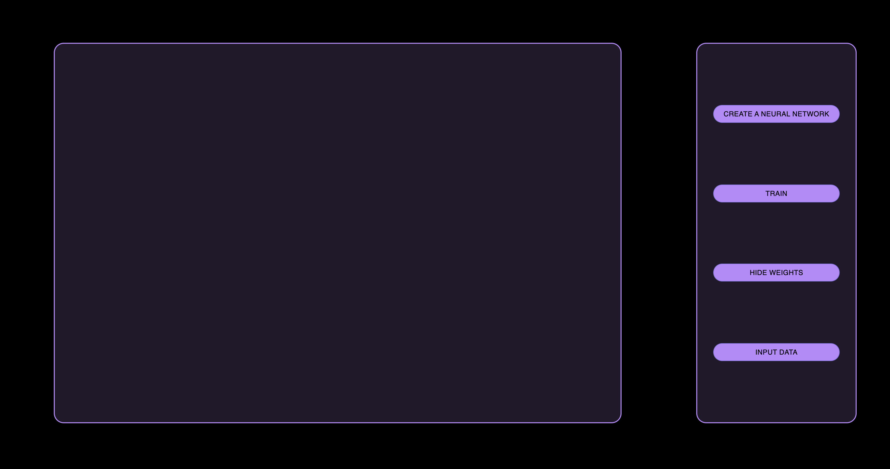
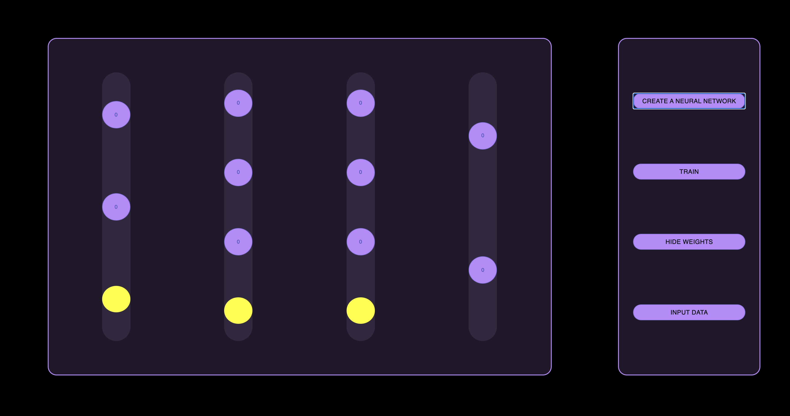
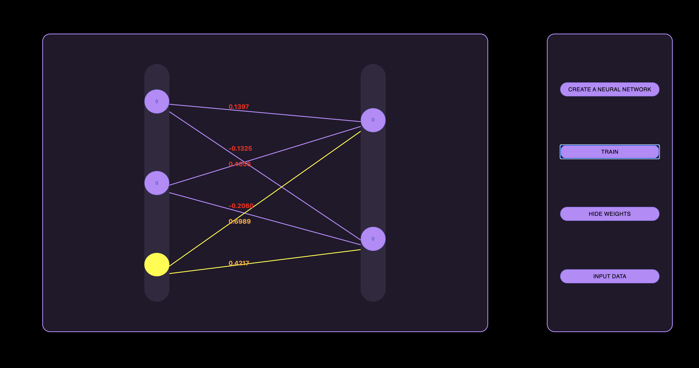

# neural-network-visualization

 &nbsp; &nbsp;A neural network is a series of algorithms that endeavors to recognize underlying relationships in a set of data through a process that mimics the way the human brain operates. In this sense, neural networks refer to systems of neurons, either organic or artificial in nature.

<h1> screen shot </h1>
<h4> start page </h4>

<h4> input data </h4>

<h4> neurons </h4>

<h4> finish </h4>

